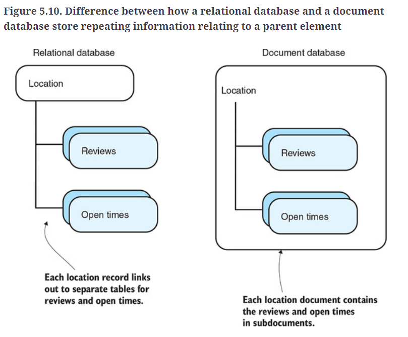

# Loc8r 

###Firsts:
* Node Back-end, not just for Angular 
* Pug 
* Express
* [Heroku and Heroku with Git](https://devcenter.heroku.com/articles/git#create-a-heroku-remote)
* [Heroku deployment problems](https://devcenter.heroku.com/articles/troubleshooting-node-deploys)
  * Repo was just on Heroku, Heroku deploy broke at same time as dual repo (github/heroku)
  * Updated to node 17.7.1 as heroku using this..
* Continuous Deployment

### Org:
Gra-m

By: Gram 

On: March 8th

### Project resources used or useful

* heroku apps
* heroku create --region eu
* git push heroku main/master
* git reset HEAD^ blat the last commit
* git reset --soft unstage files
* git reset --hard remove changes since last commit?
* git reset --hard commit return to that commit

MongoDb:
* mongosh 
* db.shutdownServer() (restart service to use again)
* db.hello()
* db.serverStatus()
* db.stats()
  * close connection from cl:
  * Type .exit, exit, or exit().
    Type quit or quit().
    Press Ctrl + D.
    Press Ctrl + C twice.

Windows
* window r -> services.msc -> restart mongo

##Remember
* [Future start point for gmaps](https://developers.google.com/maps/documentation/api-picker?hl=en-GB)
Set git remotes in webstorm git push heroku main will not work otherwise (observed behaviour 21032022)

[Markdown Cheat Sheet](https://github.com/adam-p/markdown-here/wiki/Markdown-Cheatsheet "Adam P")

[Stack Edit](https://stackedit.io "31/08")

[Dillinger](https://dillinger.io "until you are off of visible page..")

Table of Contents:

1. [Chapter 3](#1)
2. [Chapter4](#2)

   a. [Sub Heading a](#2a)
3. [Heading 3](#3)
4. [Heading 4](#4)

##Chapter 3:
Finished @ [a126cfe](https://github.com/gra-m/Loc8r/commit/a126cfe332a62fd6bc81ac4941bd7e642959d2c5)
* Simple ways of defining and organizing routes in Express
* How to use Node modules to hold the controllers
* The best ways to set up multiple sets of controllers by proper definition of the routes
* Prototyping views with Pug and Bootstrap
* Making reusable Pug components and mixins
* Displaying dynamic data in Pug templates
* Passing data from controllers to views

##Chapter 4:

###Relational vs Document database
*I was thinking to myself -- different schemas/tables!* But:

###Compiling a MongoDB model from mongoose schema:
follows this pattern:
mongoose.model('modelname', 'schemaToUse', 'MongoDBCollectionIfItAlreadyExixts');

so this line was added below the schema definition:
mongoose.model('location', locationSchema);

* npm i mongoose
* 

SubHeading 2a:

Heading 3:

Heading 4:
